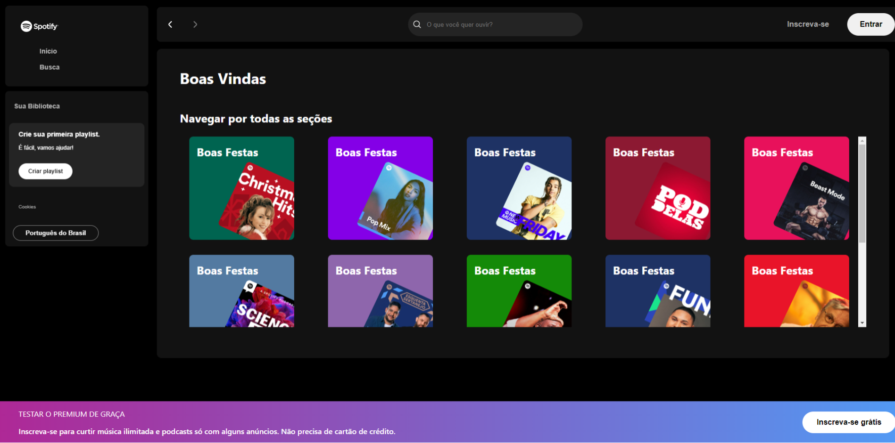

<h1 align="center"> FocusTime </h1>

Projeto promovido pela Alura na Imersão front-end para ensino de tecnologias WEB, usando HTML, CSS, lógica de programação em JavaScript e React

  <a href="#-tecnologias">Tecnologias</a>&nbsp;&nbsp;&nbsp;|&nbsp;&nbsp;&nbsp;
  <a href="#-projeto">Projeto</a>&nbsp;&nbsp;&nbsp;|&nbsp;&nbsp;&nbsp;
  <a href="#-script">Script</a>&nbsp;&nbsp;&nbsp;|&nbsp;&nbsp;&nbsp;
  <a href="#memo-licença">Licença</a>

  

 

## 🚀 Tecnologias

Esse projeto foi desenvolvido com as seguintes tecnologias:

- HTML e CSS
- Git e Github
- JavaScript
- React

## 💻 Projeto

Spotify-React é um projeto WEB para fins de estudo de tecnologias WEB, trazendo o layout inspirado na plataforma de Spotify de reprodução de músicas e podcasts.

## 🔖 Scripts Disponíveis

No diretório do projeto, você pode executar:

### `npm start`

Executa o aplicativo no modo de desenvolvimento.\
Abra [http://localhost:3000](http://localhost:3000) para visualizá-lo em seu navegador.

## 📝 Licença

Esse projeto está sob a licença MIT.

Este projeto foi incializado com [Create React App](https://github.com/facebook/create-react-app).

---

Feito com ♥

